# Me'morAI — Supabase / PostgreSQL Ma'lumotlar Bazasi Sxemasi & Arxitektura Memorandumi
## Архитектурный меморандум схемы БД Supabase / PostgreSQL для Me'morAI

**Loyiha / Проект:** Me'morAI (O'zbekiston QMQ / ShNQ Qurilish Me'yorlari AI Audit Tizimi)  
**Versiya / Версия:** 1.0.0  
**Sana / Дата:** 2026-09-30  
**Muallif / Автор:** Me'morAI Bosh Arxitektori (Jasper Production Standards)  
**Tegishli papka:** `D:\ALLProjects\memore-ai\supabase\`

---

## 1. Umumiy Tizim Arxitekturasi (System Overview)

Me'morAI — arxitektura chizmalari (AutoCAD DWG/DXF, PDF, BIM/IFC)ni O'zbekiston Respublikasi Qurilish va uy-joy kommunal xo'jaligi vazirligi tomonidan tasdiqlangan **QMQ (Qurilish Me'yorlari va Qoidalari)** hamda **ShNQ (Shaharsozlik Normalari va Qoidalari)** standartlariga muvofiqligini avtomatlashtirilgan tarzda audit qiluvchi sun'iy intellekt platformasidir.

Ushbu ma'lumotlar bazasi arxitekturasi **B2B ko'p-tenantlik (Multi-Tenant SaaS)** tamoyiliga asoslangan bo'lib, har bir loyiha instituti, arxitektura byurosi yoki qurilish kompaniyasiga o'z ma'lumotlarini qat'iy izolyatsiyalangan holda saqlashni kafolatlaydi (**Zero Cross-Tenant Leakage**).

---

## 2. Jadvallar Diagrammasi (Entity-Relationship Diagram)

```mermaid
erDiagram
    ORGANIZATIONS ||--|| SUBSCRIPTIONS : "has subscription (1:1)"
    ORGANIZATIONS ||--o{ USERS : "employs members (1:N)"
    ORGANIZATIONS ||--o{ PROJECTS : "owns projects (1:N)"
    ORGANIZATIONS ||--o{ DRAWING_FILES : "stores drawings (1:N)"
    ORGANIZATIONS ||--o{ COMPLIANCE_CHECKS : "conducts checks (1:N)"
    ORGANIZATIONS ||--o{ CHECK_RESULTS : "tracks results (1:N)"

    USERS ||--o{ PROJECTS : "created_by"
    USERS ||--o{ DRAWING_FILES : "uploaded_by"
    USERS ||--o{ COMPLIANCE_CHECKS : "initiated_by"

    PROJECTS ||--o{ DRAWING_FILES : "contains drawings (1:N)"
    PROJECTS ||--o{ COMPLIANCE_CHECKS : "audited via (1:N)"

    DRAWING_FILES ||--o{ COMPLIANCE_CHECKS : "inspected by (1:N)"
    COMPLIANCE_CHECKS ||--o{ CHECK_RESULTS : "details violations (1:N)"

    ORGANIZATIONS {
        uuid id PK "gen_random_uuid()"
        text name "Tashkilot nomi"
        text slug UK "URL slug"
        text stir "STIR / ИНН"
        text email
        text phone
        text address
        text city
        text logo_url
        boolean is_active
        jsonb settings
        timestamptz created_at
        timestamptz updated_at
    }

    SUBSCRIPTIONS {
        uuid id PK "gen_random_uuid()"
        uuid organization_id FK "UK references organizations"
        text plan "starter | pro | enterprise"
        text status "active | trialing | past_due | canceled"
        text billing_cycle "monthly | yearly"
        integer monthly_checks_limit "Kvote tekshiruvlar"
        integer used_checks_count "Ishlatilgan tekshiruvlar"
        integer max_file_size_mb "Maksimal fayl hajmi (MB)"
        numeric storage_limit_gb "Disk hajmi (GB)"
        numeric price_uzs "Narx (UZS)"
        timestamptz starts_at
        timestamptz expires_at
        jsonb features "DWG, PDF, IFC, API imkoniyatlari"
        timestamptz created_at
        timestamptz updated_at
    }

    USERS {
        uuid id PK "references auth.users(id)"
        uuid organization_id FK "references organizations"
        text email
        text full_name
        text role "owner | admin | architect | auditor | viewer"
        text phone
        text avatar_url
        boolean is_active
        timestamptz created_at
        timestamptz updated_at
    }

    PROJECTS {
        uuid id PK "gen_random_uuid()"
        uuid organization_id FK "references organizations"
        uuid created_by FK "references users"
        text name "Loyiha nomi"
        text code "PRJ-2026-001"
        text description
        text building_type "residential | commercial | industrial | public | mixed"
        text address
        text city
        integer total_floors
        numeric total_area_sqm
        integer seismic_zone "7 | 8 | 9 ball"
        text status "draft | active | in_review | approved | archived"
        jsonb metadata "Kadastr, bosh me'mor va h.k."
        timestamptz created_at
        timestamptz updated_at
    }

    DRAWING_FILES {
        uuid id PK "gen_random_uuid()"
        uuid organization_id FK "references organizations"
        uuid project_id FK "references projects"
        uuid uploaded_by FK "references users"
        text file_name "Reja_1-qavat.dwg"
        text file_type "dwg | dxf | pdf | ifc | rvt"
        bigint file_size_bytes
        text storage_path "Supabase Storage bucket path"
        text bucket_name "drawings"
        integer version "1, 2, 3..."
        text checksum_sha256
        text status "uploaded | processing | parsed | error"
        jsonb parsed_data "Parserdan olingan geometriya"
        text error_message
        timestamptz created_at
        timestamptz updated_at
    }

    COMPLIANCE_CHECKS {
        uuid id PK "gen_random_uuid()"
        uuid organization_id FK "references organizations"
        uuid project_id FK "references projects"
        uuid drawing_file_id FK "references drawing_files"
        uuid initiated_by FK "references users"
        text check_type "full | fire_safety | room_dimensions | insolation | accessibility"
        text standard_code "QMQ | ShNQ | GOST | ALL"
        text status "pending | in_progress | completed | failed | requires_review"
        integer total_rules
        integer passed_count
        integer failed_count
        integer warning_count
        numeric compliance_score "0.00 - 100.00 %"
        jsonb compliance_results "Agregatsiyalangan to'liq JSON"
        text summary_uz "Xulosa (O'zbekcha)"
        text summary_ru "Заключение (Русский)"
        integer duration_ms "Audit vaqti (ms)"
        timestamptz completed_at
        timestamptz created_at
        timestamptz updated_at
    }

    CHECK_RESULTS {
        uuid id PK "gen_random_uuid()"
        uuid organization_id FK "references organizations"
        uuid compliance_check_id FK "references compliance_checks"
        text rule_id "QMQ_2_08_01_89_CL_1_25"
        text code "QMQ 2.08.01-89*"
        text clause "1.25"
        text category "yashash_binolari | yongin_xavfsizligi"
        text severity "critical | high | medium | low"
        text status "pass | fail | insufficient_evidence | requires_review"
        text title_uz
        text title_ru
        jsonb actual_value "haqiqiy o'lchov: {'height_m': 2.80}"
        jsonb required_value "normativ talab: {'min_height_m': 2.70}"
        text message_uz
        text message_ru
        numeric confidence "0.000 - 1.000"
        jsonb evidence_bbox "[x1, y1, x2, y2]"
        integer source_page
        text notes
        timestamptz created_at
        timestamptz updated_at
    }
```



---

## 3. Asosiy Relyatsion Jadvallar va Qarorlar Izohi

### 3.1. `organizations` (Tashkilotlar / Организации)
- **Maqsadi:** Har bir mijoz (loyiha instituti, studiya, qurilish kompaniyasi) mustaqil tenant hisoblanadi.
- **Qarorlar:**
  * `stir` (ИНН): O'zbekiston qonunchiligiga binoan har bir korxonaning 9 xonali soliq to'lovchi kodi saqlanadi.
  * `settings`: Tashkilotning birlamchi standartlari (QMQ/ShNQ), seysmik zonasi (8 ball default), interfeys tili va xabarnoma parametrlari JSONB da saqlanadi.

### 3.2. `subscriptions` (Tariflar va kvotalar / Подписки и квоты)
- **Maqsadi:** SaaS monetizatsiyasi va server resurslari (CAD hisob-kitob, AI Vision parsing) xarajatlarini nazorat qilish.
- **Qarorlar:**
  * `plan`: `starter` (10 tekshiruv/oy), `pro` (100 tekshiruv/oy), `enterprise` (cheksiz/maxsus).
  * `monthly_checks_limit` va `used_checks_count`: Backend tekshiruvni boshlashdan oldin limitni qat'iy tekshiradi (`used_checks_count < monthly_checks_limit`).
  * `price_uzs`: `numeric(14, 2)` formatida — O'zbekiston milliy valyutasi (so'm) uchun tiyinlar aniqligi bilan.

### 3.3. `users` (Foydalanuvchilar profillari / Профили пользователей)
- **Maqsadi:** Supabase Auth (`auth.users`) tizimi bilan uzviy integratsiya qilingan foydalanuvchi profili.
- **Qarorlar:**
  * `id references auth.users(id) ON DELETE CASCADE`: Autentifikatsiya tokeni orqali kirgan foydalanuvchining UUID si to'g'ridan-to'g'ri `public.users` ning birlamchi kalitiga aylanadi.
  * `role`: `owner` (tashkilot asoschisi), `admin`, `architect` (loyiha yaratuvchi va chizma yuklovchi), `auditor` (qoidalarni tekshiruvchi ekspert), `viewer` (faqat ko'ruvchi buyurtmachi).

### 3.4. `projects` (Arxitektura va qurilish loyihalari / Проекты)
- **Maqsadi:** Arxitektura ob'ekti (turar-joy majmuasi, maktab, ofis va h.k.) pasporti.
- **Qarorlar:**
  * `building_type`: QMQ bo'yicha me'yorlar bino turiga qarab tubdan farq qiladi (masalan, QMQ 2.08.01-89 turar-joy uchun, QMQ 2.08.02-89 jamoat binolari uchun).
  * `seismic_zone`: O'zbekiston hududlari seysmik faolligiga qarab (7, 8, 9 ball) qurilish konstruksiyalari va yo'laklar kengligi bo'yicha qo'shimcha koeffitsientlar hisobga olinadi.

### 3.5. `drawing_files` (Chizma va BIM fayllar / Файлы чертежей)
- **Maqsadi:** CAD va BIM fayllarini kataloglashtirish va versiyalash.
- **Qarorlar:**
  * `storage_path`: Fayl jismoniy jihatdan Supabase Storage (`drawings` xususiy bucketi)da saqlanadi.
  * `parsed_data`: Python CAD parseri (ezdxf, PyMuPDF, IfcOpenShell) ajratib olgan vektor geometriyasi (xonalar maydoni, eshik/oyna eni, devorlar qalinligi) JSONB da saqlanadi. Bu qayta-qayta og'ir faylni o'qish zaruratini yo'qotadi.

### 3.6. `compliance_checks` (Audit sessiyalari / Сессии аудита)
- **Maqsadi:** Chizma bo'yicha o'tkazilgan har bir me'yoriy tekshiruv sessiyasi va uning jamlangan xulosasi.
- **Qarorlar:**
  * `compliance_score`: Foizda (0.00% dan 100.00% gacha). Bu arxitektor va investor uchun loyihaning qanchalik me'yorga mosligini ko'rsatuvchi asosiy metrika.
  * `compliance_results`: Butun auditning to'liq JSON daraxti (kategoriyalar, buzilishlar, tavsiyalar). PDF hisobot yaratish uchun to'g'ridan-to'g'ri ishlatiladi.

### 3.7. `check_results` (Har bir qoida bo'yicha atomar natija / Результаты по нормам)
- **Maqsadi:** Python `rules_engine.py` dagi `CheckResult` dataclass'iga 100% mos atomar natijalar.
- **Qarorlar:**
  * `rule_id`, `code`, `clause`: Aniq me'yoriy asos (masalan: `QMQ 2.08.01-89*`, `1.25-modda`).
  * `actual_value` va `required_value`: JSONB formatida saqlanadi (`{"height_m": 2.80}` vs `{"min_height_m": 2.70}`). Bu turli xil o'lchov birliklari (metr, kv.metr, lyuks, gradus)ni bir xil tizimda saqlash imkonini beradi.
  * `evidence_bbox`: `[x1, y1, x2, y2]` koordinatalari orqali chizmada xatolik yuz bergan aniq joy interfeysda qizil ramka bilan ajratib ko'rsatiladi.

---

## 4. Zero Cross-Tenant Leakage & RLS Arxitekturasi

Har qanday ko'p-tenantlik tizimida Tenant A xodimi hech qachon Tenant B ning loyihalari, chizmalari, audit natijalari yoki moliyaviy ma'lumotlarini ko'rmasligi shart.

### 4.1. Kafolatlangan Prinsiplar:
1. **Har bir jadvalda `organization_id`:**  
   Barcha 7 ta jadvalda `organization_id UUID NOT NULL REFERENCES public.organizations(id) ON DELETE CASCADE` mavjud.
2. **SECURITY DEFINER keshlovchi funksiyalar:**  
   RLS siyosatlarida har bir satr uchun og'ir va rekursiv `JOIN`lar o'rniga `public.current_user_org_id()` va `public.current_user_role()` funksiyalari qo'llanadi. Ular PostgreSQL `STABLE` va `SECURITY DEFINER` rejimida ishlab, maksimal unumdorlik va nolinchi xatolikni ta'minlaydi.
3. **Rolli kirish nazorati (RBAC):**  
   - `owner` / `admin`: Tashkilot, a'zolar, loyihalar va auditlarni to'liq boshqarish.
   - `architect`: Loyiha yaratish, chizma yuklash, audit boshlash.
   - `auditor`: Me'yoriy xulosalarni ko'rish, sharh kiritish, qo'lda tasdiqlash.
   - `viewer`: Faqat ko'rish huquqi (tahrirlash va o'chirish taqiqlanadi).
4. **Service Role Mustaqilligi:**  
   AI tahlil serveri, fon protsessorlari va billing webhooks `service_role` orqali RLS cheklovisiz xavfsiz ishlaydi.

---

## 5. Indekslash va Ishlash Unumdorligi (Performance Tuning)

Ma'lumotlar bazasi minglab qavat rejalari va yuz minglab me'yoriy tekshiruv qoidalarini bir zumda saralash uchun quyidagi indekslar bilan ta'minlangan:

1. **Tenant-Scoped B-Tree Indekslar:**
   - Har bir jadvalda `(organization_id, created_at DESC)` kompozit indeksi mavjud. Bu Supabase REST API orqali qilinadigan sahifalash (`pagination` / `limit` / `offset`) so'rovlarini 100x tezlashtiradi.
2. **JSONB GIN Indekslari:**
   - `compliance_checks.compliance_results USING GIN` — murakkab xatoliklar bo'yicha qidiruv.
   - `drawing_files.parsed_data USING GIN` — qavat rejasidagi xonalar nomi va o'lchamlari bo'yicha tezkor filtr.
   - `check_results.actual_value USING GIN` va `check_results.required_value USING GIN`.
3. **Chet El Kalitlari (Foreign Keys) Indekslari:**
   - Barcha bog'lovchi kalitlar (`project_id`, `drawing_file_id`, `compliance_check_id`, `uploaded_by`) to'liq indekslangan.

---

## 6. Migratsiyalarni Ishga Tushirish Yo'riqnomasi

### Supabase CLI orqali:
```bash
# 1. Supabase loyihasini tekshirish
supabase status

# 2. Migratsiyalarni ketma-ket qo'llash
supabase db push

# 3. Yoki yangi lokal bazani qayta yuklash va seed ma'lumotlarni kiritish
supabase db reset
```

### PostgreSQL (psql / DBeaver) orqali to'g'ridan-to'g'ri ishga tushirish:
```sql
\i D:/ALLProjects/memore-ai/supabase/migrations/001_initial_schema.sql
\i D:/ALLProjects/memore-ai/supabase/migrations/002_rls_policies.sql
\i D:/ALLProjects/memore-ai/supabase/seed.sql
```

---

## 7. Python `rules_engine.py` bilan Ma'lumotlar Sinxronizatsiyasi

Me'morAI Python dvigateli tekshiruv natijalarini Supabase ga quyidagi algoritm orqali yozadi:

1. `drawing_files` jadvalidan `parsed_data` olinadi yoki yangi fayl parse qilinadi.
2. `compliance_checks` da `status = 'in_progress'` yozuvi yaratiladi.
3. `QMQRulesEngine.evaluate(project_data)` ishga tushadi.
4. Har bir qaytgan `CheckResult` ob'ekti `check_results` jadvaliga `INSERT` qilinadi.
5. Umumiy ball hisoblanib, `compliance_checks` dagi `compliance_score`, `compliance_results` (JSON) va `status = 'completed'` yangilanadi.
